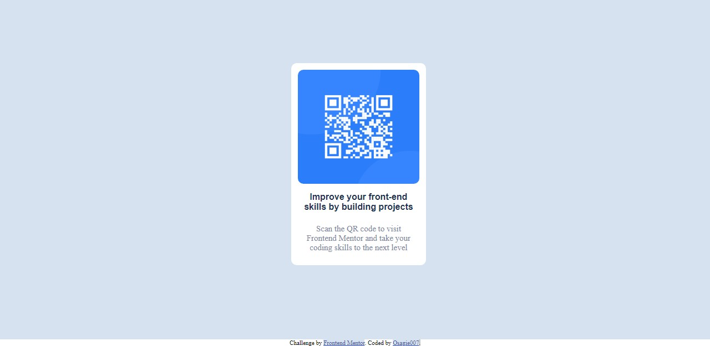
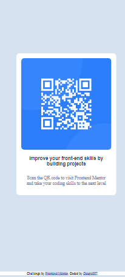

# qr_code
# Frontend Mentor - QR code component solution

This is a solution to the [QR code component challenge on Frontend Mentor](https://www.frontendmentor.io/challenges/qr-code-component-iux_sIO_H). Frontend Mentor challenges help you improve your coding skills by building realistic projects. 

## Table of contents

- [Overview](#overview)
  - [Screenshot](#screenshot)
  - [Links](#links)
- [My process](#my-process)
  - [Built with](#built-with)
  - [What I learned](#what-i-learned)
  - [Continued development](#continued-development)
  - [Useful resources](#useful-resources)
- [Author](#author)
- [Acknowledgments](#acknowledgments)

## Overview

### Screenshot

 

### Links

- Solution URL: [Click here](https://github.com/Osagie007/qr_code)
- Live Site URL: [Click here](https://osagie007.github.io/qr_code/)

## My process

### Built with

- Semantic HTML5 markup
- CSS custom properties
- Flexbox


### What I learned

Through this exercise i have been able to perfect my use of css flexbox and to efficiently deliver a responsive web design template.

To see how you can add code snippets, see below:

```html
<div class= "container"> 
</div>
```
```css
.container {
      display: flex;
}
```

### Continued development

I'd like to learn JavaScript in other to bring more functionalities into my work.web framewoks like React, Angular and Bootstrap, will be learnt.

### Useful resources

- [W3Schools](https://www.w3schools.com) - This helped me generally, in HTML and CSS.
- [StackOverflow](https://www.stackoverflow.com) - This is an amazing website which helped me when i developed issues. Issues such as Image coming out of its div and things like that.

## Author

- Website - [Eluojerio Osagie .R](https://www.your-site.com)
- Frontend Mentor - [@Osagie007](https://www.frontendmentor.io/profile/Osagie007)
- Twitter - [@OsagieRonald](https://www.twitter.com/OsagieRonald)

## Acknowledgments

I would like to thank the team of CS50 online lecturers, Eniola, Damilola_Adekoya and my close associate Bode.


